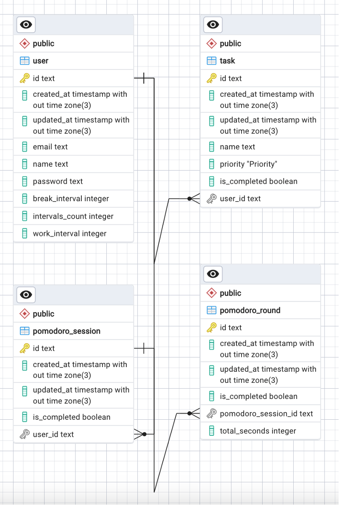

# Task app server for coursework

## How to run

* Clone this project
* Install dependencies
```bash
npm install
```
* Install Prisma
```bash
npm install -g prisma
```
* Add DATABASE_URL and JWT_SECRET in .env
* Synchronize the Prisma schema with the database schema.
```bash
prisma db push
```
* Start the server
```bash
npm run start:dev
```

## STACK

* Nest.js
* Prisma
* TypeScript

## Database scheme
|                  Database                 |
|:-----------------------------------------:|
|           | 
